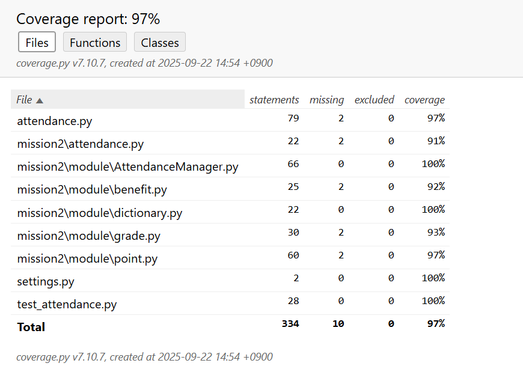

<table>
  <tr>
    <td colspan="2">요구사항 체크 리스트</td>
  </tr>
  <tr>
    <td >D1</td>
    <td>O</td>
  </tr>
  <tr>
    <td >D2</td>
    <td>O</td>
  </tr>
    <tr>
    <td >D3</td>
    <td>O</td>
  </tr>
    <tr>
    <td >D4</td>
    <td>O</td>
  </tr>
  <tr>
    <td >D5</td>
    <td>O</td>
  </tr>
</table>

## Code Coverage

#### summary 

#### attadence.py

#### mission2\attendance.py

#### mission2\module\AttendanceManager.py

#### mission2\module\benefit.py

#### mission2\module\dictionary.py

#### mission2\module\grade.py

#### mission2\module\point.py

#### settings.py

#### test_attendance.py	

